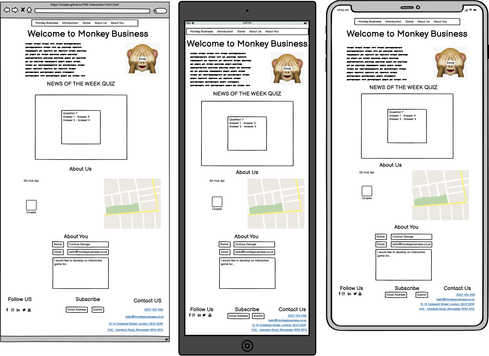

# Monkey Business
My Milestone 2 is a marketing website for a fiction gaming advertising company called Monkey Business. It was designed as a desktop first approach with media queries to make it responsive & accessible on all devices.

## UX

### User stories

#### First Time Visitor Goals
1. My goal is for visitors to easily understand what Monkey Business does and easily scroll through and learn about the services we offer. 
2. Visitors should be able to navigate through the sight with ease and know exactly where they are on the site.
3 Find & play the quiz with ease 
4.Visitors should be able to find all available avenues to contact us, via phone, email, social media and our physical address, find us on the google maps api, find our work using the github api.
 

#### Returning Visitor Goals
1. Returning visitors should be able to navigate through the sight with ease and know exactly where they are on the site.
2. Returning visitors should be able to find all available avenues to contact us, via phone, email, social media and our physical address, find us on the google maps api, find our work using the github api

#### First Time User 
* a Marketing professional, who will see what services we offer, and experience what products we can make and how we can tailor our products to help them market their products,

#### Returning Time User 
* I want to be able to find contact information & current projects and social media profiles to follow.

### Design

#### Colour Scheme
Black and White are the main site colors, as well as blue, green and teal.

#### Typography
Lato font is the main font used throughout Monkey Business site, with Sans Serif as a backup font for any reason Lato isn't imported correctly.Lato is a humanist sans-serif typeface. The name "Lato'' is Polish for "summer". As of August 2018, Lato is the third most served font on Google Fonts making it a familiar font without defaulting to Times Roman.

#### Imagery
1. Our Company Logo is the Mizaru, also known as “three wise monkeys”, if you click on his image in the introduction section you using javascript he will change between “See no Evil“ and “Speak no Evil”
2. The second image is a group of people wearing makeshift PPE reflecting that we take our role of looking after our customers and partners seriously. 
3. The third image is a hillside filled with windmills, reflecting how we are aware that the travel industry is detrimental to the environment and that we are committed to minimising the environmental impact our services will have on the environment with a ISO14001.
4. The fourth image is a woman writing code, to reflect that through our partnership our partners will build bespoke travel programmes around the customers' needs. 
5. The fifth and final image is of a conference, to highlight our M.I.C.E Service offering. 

### Wireframes
[Balsamiq:](https://balsamiq.com/) was used to create the during the below wireframe
* Index Wireframe (Desktop, Tablet & Mobile)

## Features
1. Simple to use lay out
2. responsive across all devices 
3. interactive forms, buttons
4. Interactive Javascript Quiz
5. Interactive API (Github, Google Maps)

## Technologies Used
HTML - 69.7% (https://html.com/html5/)
CSS - 30.3% (https://www.w3.org/TR/CSS/#css)
JavaScript - (https://www.javascript.com/)

### Frameworks, Libraries & Programs Used
1. [Balsamiq:](https://balsamiq.com/) was used to create the during the planning stage.
2. [GitHub:](https://github.com/) was used to store the project code after being pushed from Git.
3. [Git](https://git-scm.com/) was used for version control by utilizing the Gitpod terminal to commit to Git and Push to GitHub.
4. [Google Fonts:](https://fonts.google.com/) was used to import Lato font into the style.css file. Lato Font is used on all pages throughout the project.
5. [Bootstrap 4.4.1:](https://getbootstrap.com/docs/4.4/getting-started/introduction/) was used to make the site responsive and used the grid system for it’s lay out. 
6. [Font Awesome:](https://fontawesome.com/) was used to add icons throughout the site for aesthetic and UX purposes. 
7. [Flaticon:](https://www.flaticon.com/) was also used to add icons throughout the site for aesthetic and UX purposes.

## Testing
* There was a white line down the right had side which I fixed with padding. 
* The footer when on Mobile & Tablet was squashed together and you couldn’t tell where it started and finished. Using Media Queries I made bronze borders for when the screen size is less than 1200px to define each section of the footer. 
* The Service Page image is a woman coding, however the picture was too wide for mobile, I tried to crop it using GIMP 2.1 but it wasn’t very good. I opted to change it to an image of people working from a sheet of paper and a laptop when the screen size is less than 400 px. 
* On the Service page on mobile there is a white streak along the right hand side if you scroll left.
* HTML was tested using [W3C-Markup-Validation-Service:](https://validator.w3.org/) and has no issues. 
* CSS Was tested using [W3C-CSS-Validation-Service:](https://jigsaw.w3.org/css-validator/) and has 1 parse issue.

The test results can be seen [here](https://github.com/coopsx/Thomas-Partners---Travel/blob/main/W3%20HTML%20%26%20CSS%20Test%20Results.pdf)

## Deployment

### Creation
1. I developed my project using [GitPod](https://www.gitpod.io/) 
2. I logged into GitHub and clicked New, which takes your through to the Create a new repository page.
3. I selected the [Code Institute Template](https://github.com/Code-Institute-Org/gitpod-full-template) , clicked **include all branches**, named my site and added a description, selected public and clicked **create repository**. 
4. I deployed to GitHub Pages by going into the repository, clicked settings, scrolled down to Github Pages, selected Branch:Main then /(root) and saved and retrieved the link [Thomas & Partners Link](https://coopsx.github.io/MS2-Interactive-Front-End/).

### Fork
Log into GitHub, Locate [MS2-Interactive-Front-End](https://coopsx.github.io/MS2-Interactive-Front-End/l), on the top right of the page, click fork, and it will copy the repository into your GitHub account. 

### Cloning
To clone you will need [GitPod]() & GitHub. 
1. Log into Github,
2. Find the MS2-Interactive-Front-End [repository](https://coopsx.github.io/MS2-Interactive-Front-End/l),
3. Click the **GitPod** button, this will create a new workspace with the loaded code that you can now work from. 

## Credits
All Code & Content was written by Thomas Jackson.

### Media
The photos used in this site were obtained from [Pexels:](https://www.pexels.com/) & [Pixabay:](https://pixabay.com/).
Code Video by Bedrijfsfilmspecialist.nl from Pexels

### Acknowledgements
I was inspired by my previous employers Reed & Mackay, Egencia, & DialAFlight for this project.
A Special thanks to my mentor Nishant Kumar for his continued support, patience & mentorship.
Miklos - Code Institute Tutor - for helping me configure my Google Maps API Brian Design - for helping configure my emoji switch (https://www.youtube.com/watch?v=mCQ1-iDSnto)
Gifer - Loading Circle (https://gifer.com/en/7gQj)
Kyle - Javascript Quiz Workflow - (https://www.youtube.com/watch?v=riDzcEQbX6k)
Purple Photo by Scott Webb from Pexels
Technology Video by Pressmaster from Pexels
Francesco by Francesco Ungaro from Pexels
Arcade Photo by Element5 Digital from Pexels
Water Photo by yudy pirmansah from Pexels
